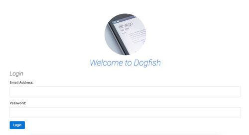

# login-fun
A straightforward login system built with PHP, mySQL &amp; SASS

<h2> What it does. </h2>

 Submitting the form on the homepage with a valid username and password will log the user in
if the password or username is not valid, the user will be shown an error. Logged in users will be
able to log out again. Once logged out the login page will no longer be accessible. 

<h3> How it works. </h3>
<ul>  
<li> A username and password are stored inside a database. </li>
<li> When the from on the homepage is submitted the username and password are used to within a mySQL query </li>
<li> Any errors are displayed back to the user. </li>
<li> The form should not submit if empty </li>
<li> The form should not login if user name and password do not match the database </li>
<li> If the username and password are correct a cookie is sent to the browser and retained for 30mins </li>
<li> If a user logs out then the cookie is altered to constitute logout </li>
<li> Bootstrap 4 is used to help make the design more responsive, this could also have been achieved with Suzy or plain media queries </li>
<li> Grunt is used for task running </li>
</ul>
<h3> Security </h3>
<ul>  
<li>db_connection.php is kept outside of the root dir</li>
<li> database user has only been given "SELECT" privilege so there is no means of Creating, Updating or Deleting</li>
<li>Sensitive information inside the DB is encoded </li>
<li>POST_ vars are passed through the strip_tags() method in order to help prevent XSS attacks</li>
<li> Cookies are limited to only 30mins, after which time the user ceases to be logged in</li>
<li> mysqli_real_escape_string() method is used to help sanitise user input of harmful characters </li>
</ul>
There are many ways in which the security of this system could be improved. Undoubtably more than are listed below but
here are, perhaps, some of the most obvious.
<ul>
<li>Use "Sessions" instead of "Cookies" - generally considered bad practice to have sensitive info stored inside cookies</li>
<li>Session behaviour can more easily be altered for safety, such as changing the session id after a login (session_regenerate_id())</li>
<li> Inclusion of SSL certificate </li>
<li> Regular Expressions used to remove harmful characters and help decrease SQL injection </li>
</ul>
